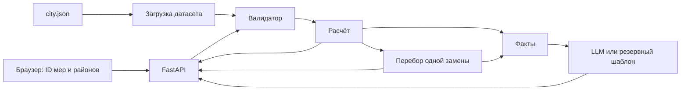

# Спецификация бэкенда от Codex: «Аким на 5 часов»

Автор: Codex. Дата: 23.09.2026. Статус: предложение для реализации и сверки командой; этот документ не означает, что код уже написан или проверен.

Источники: [полное ТЗ и данные организатора](tracks/12-akim-tz.md), [согласованная спецификация приложения](akim-spec.md), [правила репозитория](../AGENTS.md). При конфликте предметных правил приоритет у ТЗ. Документ детализирует бэкенд; изменения и дополнения к общему контракту явно перечислены в разделе 12.

План исполнения: [план бэкенда от Codex](superpowers/plans/2026-09-23-akim-backend-codex.md).

## 1. Назначение и границы

Пользователь составляет городской план из пяти мер. Сервер проверяет ограничения, рассчитывает последствия на горизонте восьми кварталов, объясняет изменение Score и возвращает проверенные альтернативы. Любые деньги, веса, эффекты и оценки берутся из серверного датасета; клиент передаёт только ID.

Успех: одинаковые исходные данные у всех; невалидный набор не получает Score; изменение допустимого набора меняет результат согласно формуле; основной сценарий работает без ключей; с ключом модель объясняет уже вычисленные факты.

В этой версии нет БД, регистрации, фоновой очереди, реальных городских данных, голосового интерфейса и внешнего поиска. Сравнение A/B выполняется фронтендом по двум ответам `evaluate`; отдельный серверный маршрут не требуется.

Выбран модульный монолит FastAPI с чистым расчётным ядром: один процесс проще запустить и проверить на хакатоне. Единый файл со всей логикой усложняет независимые тесты; разделение на микросервисы добавляет запуск нескольких компонентов без пользы для пяти районов. Расчёт и советник не зависят от HTTP и LLM.

## 2. Файлы и зависимости

| Файл | Ответственность |
|---|---|
| `data/city.json` | Единственный рабочий источник предметных данных, версия `hackalem-12-v1` |
| `engine/__init__.py` | Пакет ядра |
| `engine/model.py` | Неизменяемые dataclass предметной модели, загрузка и проверка датасета |
| `engine/validator.py` | Проверка набора, список причин, стоимость |
| `engine/scoring.py` | База, эффекты, синергии, итог, разложение, ключ сценария |
| `engine/advisor.py` | Перебор замен одной меры и отбор трёх улучшений |
| `engine/facts.py` | Факты с ID, текстовые шаблоны, резервное объяснение |
| `engine/explain.py` | Адаптер модели, проверка ответа, таймаут, ограниченный кэш |
| `engine/settings.py` | Серверная конфигурация и чтение `.env` |
| `api_models.py` | Строгие Pydantic-модели HTTP-входа и ответа |
| `app.py` | `create_app`, маршруты, лимит тела, раздача `static/` |
| `run.py` | Запуск из корня одной командой, установка закреплённых зависимостей в `.venv` |
| `requirements.txt` | Точные версии runtime-зависимостей и их транзитивных зависимостей |
| `requirements-dev.txt` | Ссылка `-r requirements.txt`, закреплённые зависимости тестирования |
| `tests/` | Математика, ограничения, советник, объяснение, HTTP и воспроизводимость |
| `.env.example`, `README.md` | Конфигурация, запуск, лицензии, демонстрационный сценарий |

Стек из общей спецификации: Python 3.11+, FastAPI, uvicorn, pydantic, openai. Дополнение: `python-dotenv` для обещанного чтения `.env`; pytest и httpx для тестирования HTTP. Конкретные версии выбираются и закрепляются после проверки установки; этот документ не выдаёт непроверенный набор версий за рабочий lock-файл.



## 3. Данные и предметные типы

Порядок показателей: `T1,T2,E1,E2,S1,S2,B1,B2,C1,C2`. Веса: `0.10,0.10,0.09,0.11,0.11,0.11,0.09,0.09,0.10,0.10`.

| ID района | Название | Доля | Значения в порядке показателей |
|---|---|---:|---|
| esil | Есиль | 0.27 | 45,62,68,72,48,55,78,60,75,70 |
| almaty | Алматы | 0.24 | 40,75,50,55,60,65,62,52,50,60 |
| saryarka | Сарыарка | 0.20 | 50,70,42,40,62,68,58,55,45,55 |
| baikonur | Байконур | 0.13 | 52,68,55,50,58,60,52,58,55,58 |
| nura | Нура | 0.16 | 55,40,45,65,38,35,55,50,60,50 |

Названия и описания показателей, полные названия мер переносятся из ТЗ без сокращений в датасет. Таблица ниже фиксирует числовой контракт.

| ID | Направление | Тип | Стоимость | Лаг | Полные эффекты |
|---|---|---|---:|---:|---|
| M1 | transport | district | 18 | 2 | T1:6, T2:9 |
| M2 | transport | city | 22 | 2 | T1:4, B2:3 |
| M3 | transport | district | 30 | 4 | T1:16, T2:20, E2:4 |
| M4 | ecology | district | 15 | 2 | E1:12, E2:3, B1:2 |
| M5 | ecology | district | 25 | 3 | E2:14, C1:4 |
| M6 | ecology | city | 20 | 4 | E1:5, E2:3 |
| M7 | social | district | 24 | 3 | S1:16 |
| M8 | social | district | 20 | 3 | S2:14 |
| M9 | social | district | 10 | 1 | S1:3, S2:3, B1:3 |
| M10 | safety | district | 12 | 1 | B1:12, B2:2 |
| M11 | safety | district | 10 | 1 | B2:12, T1:-2 |
| M12 | services | city | 14 | 1 | C2:5 |
| M13 | services | district | 28 | 4 | C1:18, E2:2 |
| M14 | services | city | 16 | 1 | C1:5, C2:2 |

Форма `city.json`: `version`, `indicators[]`, `districts[]`, `measures[]`, `rules`. Показатель: `{code,name,direction,weight,description}`; район: `{id,name,population,indicators:{code:value}}`; мера: `{id,name,direction,type,cost,lag,effects:{code:delta}}`.

`rules` содержит `budget:100`, `decision_count:5`, `max_per_direction:2`, `horizon:8`, `critical_threshold:40`, `average_weight:0.7`, `minimum_weight:0.3`, `critical_penalty:1.0`, а также:

- `synergies[]`: `{id,measure_ids,anchor_measure_id,effects}`. ID `M1+M2`, `M10+M12`, `M5+M6`; якорь — первая мера; эффекты соответственно T1:+2, B1:+2, E2:+2.
- `conflicts[]`: `{measure_ids,scope}`. M1/M3 с `scope:anywhere`, M4/M7 и M5/M13 с `scope:same_district`.

Загрузчик проверяет уникальность ID, ровно 5 районов, 10 показателей и 14 мер, известность всех ссылок, конечность чисел, диапазон показателей 0–100, положительные стоимости, целый лаг от 0 до 8, суммы долей и весов с допуском `1e-9`. Повреждённый датасет останавливает запуск с понятной ошибкой. Нельзя автоматически нормализовать исходные данные или подменять отсутствующие значения нулём.

Предметные объекты — frozen dataclass; коллекции внутри также неизменяемые (tuple и read-only mapping). Проверка `frozen=True` без защиты вложенных словарей недостаточна. Каждому расчёту принадлежит новая матрица показателей.

## 4. Валидация и ключ сценария

`Decision(measure_id: str, district_id: str | None = None)` — внутренняя модель. Во внешнем JSON городская мера передаётся **без поля** `district_id`; даже явно переданное `null` считается лишним указанием района. На границе HTTP используется информация о присутствии поля; после этой проверки внутренний `None` однозначен.

Проверяются: ровно пять решений; известность мер и районов; район обязателен для `district`; район отсутствует для `city`; каждая M-мера только один раз независимо от района; не более двух мер направления; все несовместимости; стоимость не больше 100. Охват всех пяти направлений не требуется, согласно подробным правилам ТЗ.

Каждая причина: `{code,message,decision_indexes,measure_ids}`; индексы нулевые и относятся к исходному входу. Коды: `decision_count`, `unknown_measure`, `unknown_district`, `district_required`, `district_forbidden`, `duplicate_measure`, `direction_limit`, `incompatible_measures`, `budget_exceeded`.

Проверки не падают при неизвестном ID. Сначала собираются ошибки ID и района, затем независимые ошибки набора. Стоимость считается по известным мерам, включая повторные позиции. Если хотя бы одна мера неизвестна, `cost` и `remaining_budget` равны `null`. Остаток для перерасхода отрицательный: это диагностика, а не принятие набора.

Ключ создаётся только для допустимого набора. Сортировка решений по числовой части M-ID и затем `district_id or ""`; сериализация через `json.dumps` с `sort_keys=True`, `separators=(",", ":")`, `ensure_ascii=False`; UTF-8 → SHA-256. Объект хеширования: `{dataset_version,decisions}` с городскими решениями без поля района. Ключ не зависит от порядка входа; версия датасета входит в него. В API ключ является непрозрачной строкой.

## 5. Расчёт и объяснимый вклад

Вычисления выполняются без промежуточного округления в `float`; приёмка чисел с абсолютным допуском `1e-6`. Только интерфейс форматирует вывод до двух знаков. Проверка критичности использует строго `< 40`, без допуска.

1. Скопировать 50 исходных значений.
2. В каноническом порядке добавить эффекты каждой меры, умноженные на `(8-lag)/8`. Городская мера влияет на каждый район, её стоимость платится один раз.
3. Применить активные синергии без масштабирования лагом в районе якорной меры.
4. Для каждой ячейки применить `min(100,max(0,value))` один раз после суммы.
5. Посчитать районные D, среднее по населению, минимум по текущим районам, число критических пар и итоговую формулу из ТЗ. Слабейший район ищется заново, он не зафиксирован как Нура.
6. Вычесть базовый результат. Разложение: `avg=0.7*(average-base_average)`, `min=0.3*(minimum-base_minimum)`, `crit=-(critical_count-base_critical_count)`; сумма равна `delta`.

Вклад меры: `measure_contributions[]` из `{measure_id,district_id,realized_fraction,indicator_effects[]}`, где элемент эффектов — `{district_id,code,delta_before_clip}`. Это вклад в показатели до ограничения диапазона. Отдельно возвращаются активные синергии `{id,measure_ids,district_id,effects}` и `clipping_adjustments[]` из `{district_id,code,delta}`, где delta — поправка от clip. Тогда для каждой ячейки `after-before = сумма вкладов + синергии + поправка clip`. Нельзя подписывать вклад меры как аддитивный вклад в Score: минимум, штрафы и clip делают его нелинейным.

База считается внутренним `baseline(dataset)` без валидации пяти решений. Пустой пользовательский набор всё равно невалиден. Фронтенд получает базу через `/api/city`, а не через обход правила в `/api/evaluate`.

| Контроль | База | Набор из ТЗ |
|---|---:|---:|
| Стоимость | 0 | 95 |
| D: Есиль | 62.99 | 63.4275 |
| D: Алматы | 57.06 | 57.4975 |
| D: Сарыарка | 54.65 | 56.30 |
| D: Байконур | 56.63 | 57.0675 |
| D: Нура | 49.18 | 52.9625 |
| Среднее | 56.8624 | 58.0776 |
| Минимум | 49.18 | 52.9625 |
| Критических пар | 2 | 0 |
| Score | 52.55768 | 56.54307 |

Контрольный набор: M7 Нура, M8 Нура, M10 Нура, M12 город, M5 Сарыарка. Прирост `3.98539`; слагаемые `0.85064`, `1.13475`, `2.0`. Два базовых критических показателя — S1=38 и S2=35 в Нуре. Числа являются ожидаемыми значениями тестов, не результатом тестирования ещё не написанного приложения.

## 6. Контракт HTTP

Все маршруты синхронизируются с общей спецификацией до подключения фронтенда. JSON с UTF-8, без полей стоимости/эффектов от клиента. Лишние поля запрещены на обоих уровнях, строки не приводятся из чисел. Лимит тела — 16 384 байта фактически полученных данных, включая запросы без `Content-Length`; превышение даёт 413 до JSON-парсинга.

| Маршрут | Успешный ответ | Ошибки |
|---|---|---|
| `GET /api/health` | `{status:"ok",dataset_version,ai_configured}` | При повреждённых данных сервер не запускается |
| `GET /api/city` | `{dataset_version,indicators,districts,measures,rules,baseline}` | Секреты не возвращаются |
| `POST /api/evaluate` | `Evaluation`, HTTP 200, в том числе `valid:false` | 422 для структурно неверного входа |
| `POST /api/improvements` | `{scenario_key,candidates,search_scope:"single_replacement"}` | 422 для невалидного набора |
| `POST /api/explain` | `{scenario_key,mode,model,explanation,facts,candidates}` | 422 для невалидного набора; недоступность LLM даёт HTTP 200 fallback |

Запрос всех POST:

```json
{"decisions":[{"measure_id":"M7","district_id":"nura"},{"measure_id":"M8","district_id":"nura"},{"measure_id":"M10","district_id":"nura"},{"measure_id":"M12"},{"measure_id":"M5","district_id":"saryarka"}]}
```

Структурная ошибка (не JSON, отсутствует `decisions`, объект вместо массива, лишнее поле, неверный тип) даёт 422 с `{detail:[{code:"request_schema",message,decision_indexes,measure_ids}]}`. Не возвращать сырой вход из исключений валидатора. Предметные ошибки, включая неизвестные строковые ID, дают `valid:false` на `evaluate`; те же причины в `{detail:[...]}` с HTTP 422 на двух остальных POST.

`Evaluation` всегда содержит поля из общей спецификации:

| Поля | Допустимый набор | Невалидный набор |
|---|---|---|
| `valid`, `errors` | `true`, `[]` | `false`, причины |
| `scenario_key` | SHA-256 | `null` |
| `cost`, `remaining_budget` | целые | вычислимые целые или `null` |
| `baseline_score` | `52.55768` | `52.55768` |
| `score`, `delta`, `average`, `minimum`, `critical_count` | числа | `null` |
| `decomposition` | `{avg,min,crit}` | `null` |
| `critical_pairs`, `active_synergies`, `district_results` | массивы | `null` |
| `measure_contributions`, `clipping_adjustments` | массивы | `null` |

Критическая пара: `{district_id,code,value}`. Район в `district_results`: `{id,name,population,score_before,score_after,indicators:[{code,before,after,critical}]}`. Порядок районов и показателей как в разделе 3. `baseline` в `/api/city`: `{score,average,minimum,critical_count,critical_pairs,district_results}` с одинаковыми before/after.

`ai_configured` означает наличие ключа, а не подтверждение работоспособности провайдера. `/api/health`, `/api/city`, `/api/evaluate` и `/api/improvements` никогда не вызывают LLM.

## 7. Советник

Для каждого из пяти слотов перебрать 54 назначения: 10 районных мер × 5 районов и 4 городские меры. Всего до 270 сырых замен до фильтрации. Перенос той же меры в другой район разрешён; неизменившийся набор удаляется. Верхняя оценка «до 350» в общей спецификации остаётся верной, здесь она уточнена.

Каждый кандидат проходит тот же валидатор и расчёт. Отбросить дубли по ключу сценария и улучшения `<= 1e-8`. Сортировать по `(-score,cost,scenario_key)`, вернуть первые три. ID `c1,c2,c3` назначаются после сортировки и действуют только внутри исходного сценария.

Кандидат: `{candidate_id,scenario_key,decisions,replaced,replacement,cost,remaining_budget,score,delta,decomposition}`. `replaced` и `replacement` — объекты Decision в HTTP-форме. `delta` и `decomposition` здесь относительно **исходного пользовательского набора**, а не базы; правила арифметики те же. `decisions` содержит весь допустимый набор для кнопки «Применить».

Если улучшений нет, вернуть `candidates:[]`. Формулировка: «Улучшений заменой одной меры не найдено». Нельзя называть результат глобальным оптимумом. Равный Score с меньшей стоимостью не является улучшением по текущему критерию.

## 8. Факты и AI-объяснение

Сначала сервер формирует факты: бюджет и остаток, пять выбранных мер, результаты районов, изменившиеся показатели, критические пары до/после, три слагаемых прироста, вклад мер, синергии и до трёх альтернатив. Стабильный порядок формирования → стабильные `f1…fN` для одного сценария. Факт: `{id,kind,text,data}`; `text` создаётся сервером из `data`, все числа уже посчитаны.

Объяснение:

```text
Explanation:
  summary: Statement
  strengths: list[Statement] (1..5)
  risks: list[Statement] (1..5)
  suggestions: list[Suggestion] (0..3)
Statement: {text: string (1..600), fact_ids: list[string] (1..12)}
Suggestion: {candidate_id: string, text: string (1..600), fact_ids: list[string] (1..12)}
```

Ответ модели ограничен 12 000 символов; лишние поля запрещены. Все ссылки должны существовать, повторные candidate_id запрещены. Если улучшений нет, suggestions пуст; утверждение о варианте ссылается на факт именно этого варианта. В facts обязательно включены отрицательные эффекты (например T1 от M11), оставшиеся критические пары и неизменившиеся проблемные показатели, если они есть.

Проверка существования fact_id сама по себе не доказывает истинность текста. Для чисел предлагается шаблонная вставка: модель пишет `{{f7.after}}` вместо числового значения; разрешены только скалярные числовые поля соответствующего факта из `fact_ids`. Сервер проверяет токены и подставляет собственное форматирование. В свободном тексте до подстановки цифровые числа запрещены; даже названия M7/S1 модель заменяет словами, точные ID остаются в facts. Числа прописью запрещаются промптом, но их смысл не считается автоматически верифицированным. Это ограничение честно описывается в README: числовые вставки проверены программно, качественный текст модели может требовать оценки человеком.

Модель объясняет сильные стороны, риски и компромиссы и использует только вычисленные кандидаты; она не предлагает произвольные меры и не пересчитывает Score. В UI выводится обычный текст, не HTML модели. Технический промпт и адаптер провайдера остаются на сервере.

Режимы:

- `live`: корректный проверенный ответ, `model` — фактически использованное настроенное имя модели.
- `fallback`: отсутствие ключа, сетевой сбой, ошибка провайдера, таймаут или невалидный ответ. `model:null`; объяснение построено шаблонами из тех же фактов, показана надпись «AI-советник недоступен, показано вычисленное объяснение». Фальшивый live запрещён.

Общий таймаут внешнего обращения — `LLM_TIMEOUT_S`, по умолчанию 15 секунд; не растягивать его автоматическими повторными запросами. Асинхронный адаптер не блокирует health и evaluate во время ожидания. Кэш LRU не более 100 успешных live-ответов на процесс; ключ `(scenario_key,model,prompt_version)`, где `prompt_version="akim-explain-v1"`. Сетевой fallback не кэшировать, чтобы следующий запрос мог восстановиться. При каждом ответе сохраняется scenario_key; фронтенд дополнительно проверяет актуальность своего запроса.

## 9. Запуск и конфигурация

Целевой запуск с Python 3.11+ из чистого checkout: `python run.py`. Bootstrap создаёт `.venv` внутри репозитория, использует её Python, устанавливает закреплённые зависимости при первом запуске или изменении хеша requirements, запускает uvicorn на `127.0.0.1:8000`. Процессы запускаются списком аргументов без `shell=True`, код ошибки передаётся наружу. Маркер успешной установки пишется только после успеха pip; не удалять существующую `.venv` автоматически. Путь проекта вычисляется от `__file__`, пути с пробелами поддерживаются.

Ручной путь для разработки из общей спецификации также документируется: `python -m pip install -r requirements-dev.txt`, затем `python -m uvicorn app:app --port 8000`. Ни один путь не объявляется проверенным до реального чистого запуска. Docker не добавляется в обязательный путь.

`.env` загружается по абсолютному пути корня; уже заданные переменные процесса имеют приоритет. `OPENAI_API_KEY` необязателен, пустой/пробельный ключ означает fallback. `OPENAI_MODEL` по общей спецификации — `gpt-4o-mini`; пригодность выбранной модели проверяется при реализации live-адаптера. `LLM_TIMEOUT_S` — конечное положительное число, по умолчанию 15; неверная конфигурация даёт понятную ошибку запуска. Exa и ElevenLabs для работы этих маршрутов не требуются.

Сервер не отдаёт `.env`, ключи, трассировки провайдера или содержимое конфигурации. Раздаётся только `static/`; `/api/*` не перекрывается catch-all маршрутом. Логи фиксируют код результата, режим и длительность, исключают ключи и полные HTTP-заголовки провайдера. Same-origin достаточно, CORS `*` не нужен.

## 10. Приёмка

| Проверка | Ожидаемое поведение | Тесты |
|---|---|---|
| Одинаковый старт | Одна неизменяемая версия, база 52.55768 | model, scoring |
| Контрольный набор | Цена 95, Score 56.54307, 0 критических | scoring, api |
| Любое предметное нарушение | Score null, причины; LLM не вызван | validator, api |
| Лаг и все синергии | Масштабируется только эффект меры | scoring |
| Нижняя/верхняя граница | Clip после суммы, 39.999 критично, 40 нет | scoring |
| Нелинейность | Пересчёт слабейшего района, тождество разложения и вкладов | scoring |
| Повторы/порядок/мутация | Повтор отклонён; перестановка не меняет результат; датасет цел | validator, scoring |
| Все несовместимости | M1/M3 везде; две другие пары только в одном районе | validator |
| Улучшения | Полный допустимый набор, строгий прирост, не более трёх, без дублей | advisor |
| Ошибки модели | Неверный JSON/ссылки/числа/таймаут дают помеченный fallback | explain |
| Кэш и восстановление | Не более 100 live; fallback после сбоя не блокирует следующий live | explain |
| HTTP-граница | Неизвестный ID, null, лишние поля, большие тела обработаны без 500 | api |
| Работа без ключа | Весь сценарий включая объяснение проходит offline после установки | api, smoke |
| Воспроизводимость | Чистый запуск по README в Windows и задокументированный результат | smoke |

Для smoke: health → city → evaluate контрольного набора → improvements → применить первый вариант, если он есть → explain без ключа. Отдельно проверить live с ключом и записать только режим и модель; секреты в доказательства не включать. Автотесты не требуют внешних запросов и личного аккаунта.

## 11. Порядок и критерий готовности

Порядок: данные и ограничения → расчёт и HTTP evaluate → советник и факты → AI/fallback → чистый запуск и README. UI принадлежит фронтенд-исполнителю. Временные сроки из общей спецификации не используются как доказательство выполнения.

Готовность: тесты проходят; контрольные числа совпали; основной сценарий проверен без ключа; live проверен отдельно либо честно отмечен непроверенным; README содержит запуск, конфигурацию, лицензии, ограничения и таблицу покрытия всех must-have и пяти критериев. Доступ организаторов к live согласуется отдельно, ключ в git не добавляется. Коммиты и push выполняются только с разрешения пользователя, без переписывания опубликованной истории.

## 12. Уточнения относительно общей спецификации

Это предложения Codex для согласования контрактов с исполнителями, а не скрытое изменение `docs/akim-spec.md`:

1. `/api/city.baseline` решает получение базы без признания пустого набора валидным.
2. `measure_contributions` и `clipping_adjustments` делают вклад мер проверяемым и доступным AI.
3. Определены JSON-формы кандидата, факта, объяснения, ошибки и невалидного Evaluation; неизвестные ID — предметная ошибка, типы и лишние поля — структурная.
4. Явный `district_id:null` для городской меры отклоняется по буквальному правилу «район не указывается»; frontend должен опускать поле.
5. Шаблонные числовые вставки дополняют слабую проверку одних fact_id; требуется реализовать проверку и подстановку.
6. LRU хранит только успешные live-ответы, учитывает модель и версию промпта; временный сбой не закрепляется кэшем.
7. `python run.py`, загрузка `.env` и отдельные зависимости тестирования уточняют воспроизводимый запуск одной командой.
8. Советник имеет 270 сырых замен в текущем датасете; его delta и decomposition явно отсчитываются от пользовательского сценария.

Согласованные дополнения затем переносятся в общую спецификацию и OpenAPI до интеграции UI. Сам факт появления этого документа не меняет распределение работы команды.
